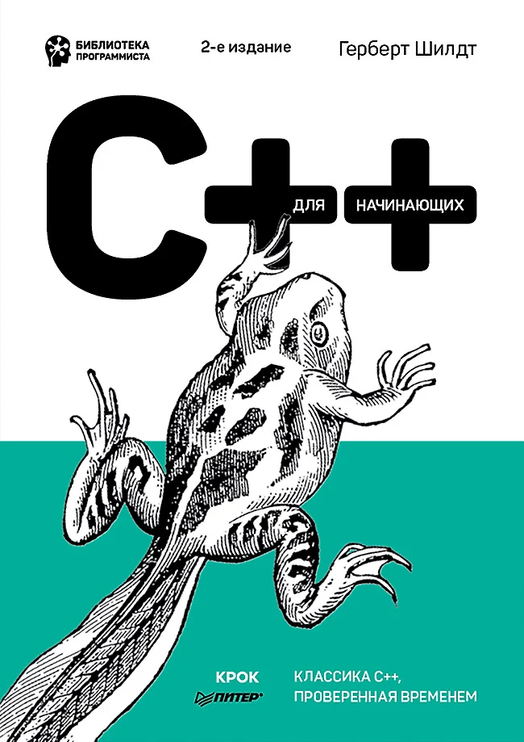

# 📘 schildtbooklearn

---

## 📝 Описание проекта / Project description

### 🇷🇺:

Здесь находятся проекты, которые предлагаются для изучения в книге о C++ (автор - Герберт Шилдт, ISBN 978-5-4461-1821-2). Данный репозиторий я сделал для своего личного использования, но подумал, что было бы неплохо оставить его в public версии.  

В случае каких-либо вопросов, замечаний, предложений пишите мне в личные сообщения. С радостью выслушаю и отвечу вам! Прошу в случае чего строго не судить меня, так как я новичок в этом. Спасибо!

---

### 🇺🇸:

Here are the projects that are offered for study in the book about C++ (author - Herbert Schildt, ISBN 978-5-4461-1821-2). I made this repository for my personal use, but I thought it would be nice to keep it in the public.  

In case of any questions, comments, suggestions, DM me. I will be happy to listen and answer you! I ask you not to judge me strictly in case of anything, because I am new in programming. Thanks!

---

## 📂 Структура репозитория / Repository Structure

### 🇷🇺:

Данный репозиторий разбит в соответствии с разбивкой книги по модулям. Всего в книге 12 модулей. Столько же и в данном проекте. Файлы, находящиеся в папках `module_*` являются моими собственными и не всегда совпадают с тем, что дается в настоящих ответах в этой книге. Лично я рекомендую использовать этот репозиторий как вспомогательную вещь при изучении данного пособия (поэтому рекомендую приобрести или же "найти" данную книгу и совмещать в случае необходимости с моими файлами).  

В случае если вы считаете, что я пишу такое, после чего можно выколоть себе глаза, то вы можете ознакомиться с официальными ответами, которые предлагаются в конце книги (приложение В). Я полностью перенес ответы на задачи (теоретические вопросы не переносил) по контрольным вопросам в конце модулей в папку `schildtbook_answers`.

Данный репозиторий я буду постепенно наполнять и совершенствовать. Повторюсь: буду рад если вы дадите мне какие-либо советы, подсказки, лайфхаки (даже самые незначительные). Я все равно это очень ценю. Спасибо!

---

### 🇺🇸:

This repository is organized in accordance with the book's modular structure. The book consists of 12 modules, and this project mirrors that with an equal number of modules. The files located in the `module_*` folders are my own work and do not always align with the official answers provided in the book. Personally, I recommend using this repository as a supplementary resource while studying the textbook (thus, I suggest purchasing or "obtaining" the book and, if necessary, combining it with my files).

If you feel that my work is so egregious it makes you want to gouge your eyes out, you can refer to the official answers provided at the end of the book (Appendix B). I have fully transcribed the answers to the exercises (though not the theoretical questions) from the review questions at the end of each module in `schildtbook_answers` folder.

I will gradually continue to populate and refine this repository. Once again, I’d be delighted to receive any advice, tips, or hacks (even the smallest ones) from you. I truly value any feedback. My contact are in profile. Thank you!

---

## 📁 Содержимое / Contents

| 📦 Folder                | 🔎 Тема (RU)                                        | 🌐 Topic (EN)                                         |
|--------------------------|----------------------------------------------------|------------------------------------------------------|
| 📁 `module_01`           | Основы C++                                         | Basics of C++                                        |
| 📁 `module_02`           | Типы данных и операции                             | Data Types and Operators                             |
| 📁 `module_03`           | Управляющие инструкции                             | Control Statements                                   |
| 📁 `module_04`           | Массивы, строки и указатели                        | Arrays, Strings, and Pointers                        |
| 📁 `module_05`           | Знакомство с функциями                             | Introduction to Functions                            |
| 📁 `module_06`           | Подробный разбор функций                           | In-Depth Function Features                           |
| 📁 `module_07`           | Еще о типах данных и операциях                     | More on Data Types and Operators                     |
| 📁 `module_08`           | Классы и объекты                                   | Classes and Objects                                  |
| 📁 `module_09`           | О классах подробнее                                | More about Classes                                   |
| 📁 `module_10`           | Наследование                                       | Inheritance                                          |
| 📁 `module_11`           | Система ввода/вывода C++                           | C++ Input/Output System                              |
| 📁 `module_12`           | Исключения, шаблоны и кое-что еще                 | Exceptions, Templates, and More                      |
| 📁 `schildtbook_tips_a`  | 💡 Приложение А. Препроцессор                      | 💡 Appendix A: The Preprocessor                      |
| 📁 `schildtbook_tips_b`  | 💡 Приложение Б. Использование старого компилятора | 💡 Appendix B: Using an Outdated Compiler            |
| 📁 `schildtbook_answers` | ✅ Официальные ответы на задачи (без теории)       | ✅ Official Exercise Answers (theory not included)   |

---

## 📬 Контакты / Contact

🗨️ Пишите в личку — профиль на [GitHub](https://github.com/PROTOTYPE9111)  
💬 DM me via GitHub profile if you have any ideas, suggestions or feedback

---

> 🌟 _Если вам помог этот репозиторий — не забудьте поставить звезду (star)!_
